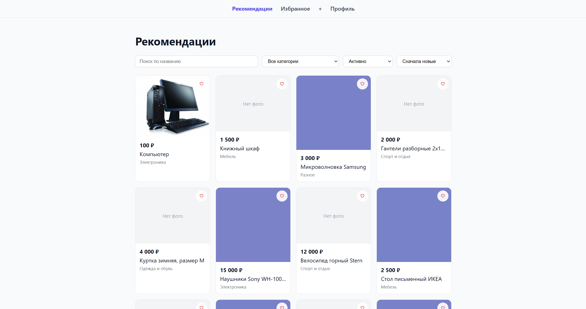

# Unishop

Доска объявлений для университета: студенты публикуют объявления (учебники, техника, мебель и т.д.), ищут их по категориям и статусу, добавляют в избранное и связываются с продавцом через Telegram.



## Возможности

- **Профиль**: имя пользователя, Telegram-тег, аватар; публичный профиль с объявлениями пользователя.
- **Объявления**: создание и редактирование (название, описание, цена, категория, состояние «новое/б/у»), до 10 фото на объявление (drag&drop или обычная загрузка).
- **Статусы объявления**: активно → забронировано/продано, забронировано → активно/продано, продано — финальный статус. Менять может только автор.
- **Лента объявлений**: поиск по названию, фильтр по категории и статусу, сортировка по цене/дате, пагинация — один переиспользуемый компонент для Главной, Избранного и «Моих объявлений».
- **Избранное**: добавление/удаление прямо с карточки объявления.
- **Авторизация** через Keycloak (OAuth2/OIDC, Authorization Code Flow): вход и самостоятельная регистрация (логин, пароль, обязательный Telegram-тег), серверная сессия в Redis, полноценный logout (в том числе завершение SSO-сессии в Keycloak).

## Стек

**Backend** — FastAPI, SQLAlchemy 2.0 (async) + Alembic, PostgreSQL, Redis (сессии), Keycloak (OIDC), MinIO (S3-совместимое хранилище фото), Authlib, слои Repository + Unit of Work, Ruff, pytest, [uv](https://docs.astral.sh/uv/).

**Frontend** — React 19 + TypeScript, Vite, Redux Toolkit / RTK Query, React Router v7, Feature-Sliced Design, CSS Modules, Biome, Vitest + Testing Library, [Volta](https://volta.sh) (фиксированные версии Node/npm).

**Инфраструктура** — Docker Compose (отдельные dev- и prod-стеки), nginx (единая точка входа в проде), GitHub Actions (CI + проверка Conventional Commits), pre-commit, Commitizen (semantic versioning), Justfile для всех команд разработки.

## Структура репозитория

```
.
├── backend/                  # FastAPI-приложение
│   └── src/backend/
│       ├── api/               # роутеры и зависимости
│       ├── core/               # конфиг, безопасность, S3-хранилище
│       ├── db/                 # модели, миграции Alembic, Unit of Work
│       ├── repositories/
│       ├── schemas/
│       └── services/
├── frontend/                 # React SPA (Feature-Sliced Design)
│   └── src/{app,pages,widgets,features,entities,shared}/
├── keycloak/realm-import.json  # конфигурация OIDC-реалма
├── nginx/nginx.conf            # прод-конфиг единой точки входа
├── scripts/seed.py             # наполнение dev-базы тестовыми данными
├── docker-compose.yml           # dev-стек
├── docker-compose.prod.yml      # прод-стек (+ nginx)
└── Justfile                     # команды разработки
```

## Требования

- Docker и Docker Compose
- [just](https://github.com/casey/just)

Для запуска бэкенда/фронтенда вне Docker понадобятся ещё [uv](https://docs.astral.sh/uv/) и [Volta](https://volta.sh) соответственно, но для обычной разработки это не нужно — всё поднимается через Docker Compose.

## Быстрый старт

1. Подготовить переменные окружения (значения по умолчанию рабочие для локальной разработки, менять не обязательно):

   ```bash
   cp .env.example .env
   cp backend/.env.example backend/.env
   cp frontend/.env.example frontend/.env
   ```

2. Поднять весь стек:

   ```bash
   just up
   ```

   Поднимутся: PostgreSQL, Redis, Keycloak (со своей БД), MinIO, backend (`:8000`), frontend (`:5173`).

3. Применить миграции БД (один раз, после первого запуска):

   ```bash
   just migrate
   ```

4. (опционально) Наполнить базу тестовыми пользователями и объявлениями:

   ```bash
   just seed
   ```

   Создаст пользователей `demo1` / `demo2` / `demo3` (пароль `Demo12345!`, все с настроенным Telegram-тегом) и набор объявлений в разных категориях и статусах — удобно для ручной проверки без регистрации вручную.

5. Открыть приложение: **http://localhost:5173**

Полезные адреса:

| Сервис | URL | Доступ по умолчанию |
|---|---|---|
| Frontend | http://localhost:5173 | — |
| Backend (Swagger UI) | http://localhost:8000/docs | — |
| Keycloak Admin Console | http://localhost:8080 | `admin` / `change-me` |
| MinIO Console | http://localhost:9001 | `unishop` / `change-me` |

Остановить стек: `just down`.

## Продакшн

```bash
just up-prod
```

Поднимает тот же набор сервисов, но с production-сборками (без bind-mount'ов и hot-reload) и добавляет **nginx** как единую точку входа на `:80`: раздаёт статику фронтенда, проксирует `/api/` на backend и `/media/` на MinIO (сам MinIO наружу не публикуется).

> `docker-compose.prod.yml` — рабочий каркас для деплоя, но перед реальным продакшеном стоит: задать собственные пароли и секреты (в `.env`/`backend/.env` по умолчанию — заглушки `change-me`), поставить TLS перед nginx и перевести Keycloak в строгий hostname-режим с HTTPS (сейчас `--hostname-strict=false`, что удобно для локальной проверки прод-сборки, но не для реального интернета).

## Разработка

Все команды — через `just` (`just --list` — полный список):

| Команда | Назначение |
|---|---|
| `just lint` / `just lint-fix` | линт бэкенда (Ruff) и фронтенда (Biome) |
| `just format` / `just format-check` | форматирование |
| `just test` | тесты бэкенда (pytest) и фронтенда (Vitest) |
| `just makemigrations "message"` | сгенерировать Alembic-миграцию из изменений моделей |
| `just migrate` / `just migrate-down` | применить / откатить миграции |
| `just precommit-install` | поставить git-хуки (один раз после клонирования) |
| `just precommit` | прогнать все pre-commit хуки вручную |
| `just logs` / `just logs-backend` / `just logs-frontend` | логи контейнеров |
| `just restart` / `just restart-backend` / `just restart-frontend` | перезапуск |

## Коммиты и версионирование

Проект следует [Conventional Commits](https://www.conventionalcommits.org/). PR-ы мёржатся squash'ем, поэтому конвенции должен соответствовать **заголовок PR** — это проверяется отдельным CI-джобом. Версии (`backend/pyproject.toml`, `frontend/package.json`) и `CHANGELOG.md` обновляются через [Commitizen](https://commitizen-tools.github.io/commitizen/):

```bash
just bump-preview     # посмотреть будущую версию и changelog, ничего не меняя
cz bump --changelog   # забампать версию и обновить CHANGELOG.md
```

## CI

На каждый PR в `master` (GitHub Actions): линт и тесты бэкенда (Ruff, pytest), линт/сборка/тесты фронтенда (Biome, `tsc` + `vite build`, Vitest), проверка заголовка PR на соответствие Conventional Commits.
